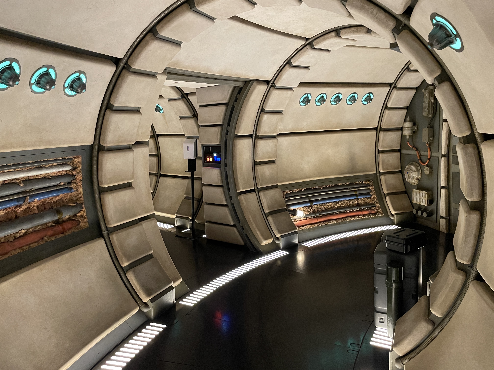
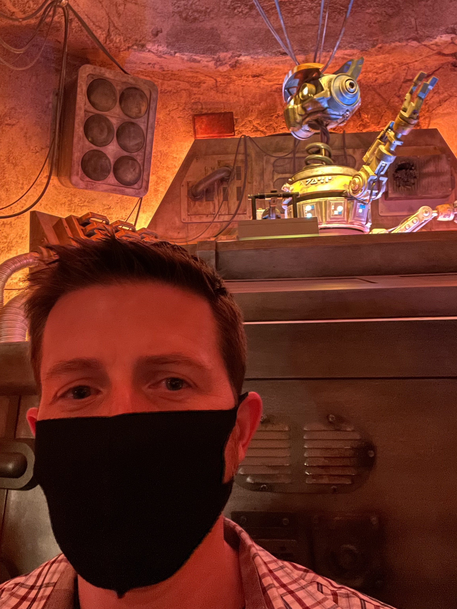

My _Star Wars_ fandom has waned a bit over the years, but on occasion my memories of watching _A New Hope_ over, and over come rushing back. For example, I cried (sobbed really) during _The Force Awakens_ and _The Last Jedi_. My eyes stayed dry during _The Rise of Skywalker_ though. Draw your own conclusions there.

Over the holiday break I found myself in Walt Disney World for a last chance at a trip that was twice rescheduled due to Covid. The crowds were insane, which was extremely concerning due to the explosion in cases from the Omicron variant. One of the few moments where I was able to be completely transported away from this Covid hellscape was the time I spent in _Galaxy's Edge_.

All of it was amazing, but the somewhat surprising highlight for me was _Millennium Falcon: Smuggler's Run_. I had heard disappointing things about the ride, but it really hit me hard in the nostalgia zone. I was selected to be one of the pilots, so it was like Star Tours except I was in control. And look how faithful the interior of the ride is.

The hand sanitizer dispenser kind of gives it away though. Thanks Covid.

_Rise of The Resistance_ was amazing as well, but still had nothing on piloting the Millennium Falcon. Even my _Star Tours_ trip was great this time around (no prequel trilogy nonsense.) Speaking of _Star Tours_, I was even able to catch up with an old friend at the Cantina. I sure wish he was willing to wear a mask though.

