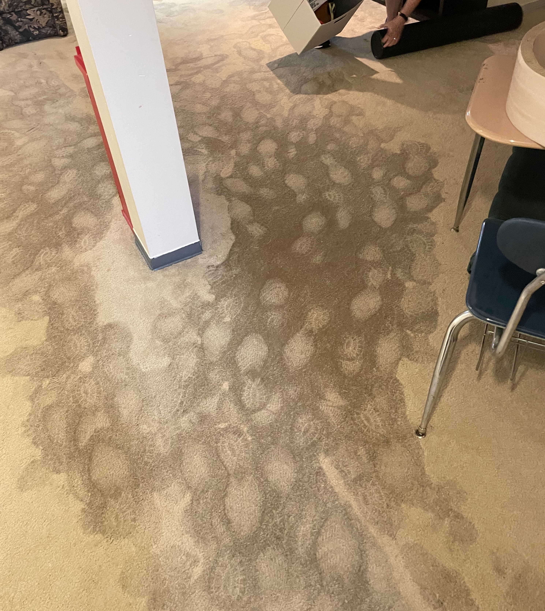

It has been an eventful couple of weeks.

June 17th was my last day at [Bounteous](https://www.bounteous.com/). I enjoyed my nearly five years there immensely, and am proud of the work I was able to within their amazing Drupal practice. I also had the unique opportunity to contribute to the company's re-branding efforts during a huge period of growth. But most of all I am extremely grateful for all the support I was given to contribute back to the Drupal community, both at events and online in the issue queue.

I took a little time off in between and was able to squeeze in a family trip to South Haven Michigan. It was our first time there, but we were able to find a nice AirBnb with private beach access. Not quite our typical Rhode Island trip (we were gun shy about air travel with a our son who isn't yet old enough to be vaccinated,) but it did he trick.

And then this shit happened:

The day after we got back from South Haven I was stuck in line at the DMV in the pouring rain, and came home to find some standing water coming up through the unfinished portion of our basement, along with wet spots coming up through the carpet in the finished portion of the basement. The next day we got more rain, and the water got worse. Since we were home, we were able to get our possessions out, but now the main floor of our house is cluttered beyond belief. We'll know more in the next day or so, but it looks like some pretty serious issues and possibly a problem with the foundation at ground level. Yikes!

Basement be damned, I started my new role at [Pantheon](https://pantheon.io/) on Monday. It was a very welcome distraction after a long, wet weekend. I'll be working within the Professional Services team as a Senior Technology Consultant focused on Decoupled Architectures. I'm really excited about what Pantheon is working on to support Decoupled sites, and happy to have the opportunity to be a part of it.

Between the new job and what will likely be a torn up basement, I'm probably still in for a few wild weeks. But I'd eventually be fine with things being boring for a bit at some point.
