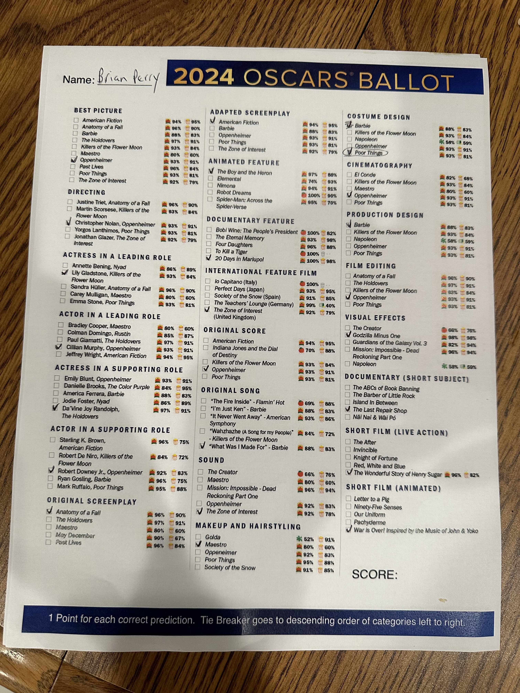

Ever since streaming made the years Oscar films so much easier to watch, I've tried to make sure I see all the best picture nominees before the awards ceremony. I connected with some more than others, but no real duds this year (I'm looking at you Elvis.)

## My favorite movie of the year

- [Past Lives](https://www.imdb.com/title/tt13238346/) - Past Lives echoes the themes of some of my favorite movies like Eternal Sunshine of the Spotless Mind (which actually appears on screen in this) and Lost in Translation, which might give this a bit of an unfair advantage. Regardless, this was the movie that stuck with me the most. Greta Lee is fantastic, and compared to a number of other bloated nominees not a moment is wasted in its hour and forty-five minute runtime. I see myself revisiting this one again in the future.

## Movies I Loved

- [Barbie](https://www.imdb.com/title/tt1517268/) - I re-watched this little known indie gem to see if I still felt the same way about it in comparison to 'serious' Oscar movies. Turns out Barbie still rules. Still extremely funny, and in a perfect world Gosling would win best supporting actor. Sure, it probably tries to do a little too much, but on re-watch I was surprised how well everything came together in the third act.

- [Poor Things](https://www.imdb.com/title/tt14230458/) - Emma Stone is amazing in this and would be my pick for best actress. Drags a little bit in the second half, but still really loved it. Interested in working through some of Yorgos Lanthimos' other movies.

- [The Holdovers](https://www.imdb.com/title/tt14849194/) - it really doesn't get much better than Paul Giamatti and Da'Vine Joy Randolph together in this. A warm hug of a movie with bonus points for spending time in '70s Boston.

## Movies I Liked

- [American Fiction](https://www.imdb.com/title/tt23561236/) - enjoyed this quite a bit, but by the end felt like there were a few different movies in conflict with each other. Excellent performances from both Jeffrey Wright and Sterling K. Brown though.

- [Oppenheimer](https://www.imdb.com/title/tt15398776/) - an achievement, but not really what I'm looking for from Nolan. Impressive pacing despite its length. Had a little trouble looking past some of the well known faces that kept popping up, and not as crazy about Robert Downey Jr. in this as others seem to be.

- [Anatomy of a Fall](https://www.imdb.com/title/tt17009710/) - entertaining and well acted, although my mind will probably always just think of Snoop the dog, and the instrumental cover of P.I.M.P.

- [The Zone of Interest](https://www.imdb.com/title/tt7160372/) - amazing use of sound, but boy was it a tough watch. Did find the final sequence extremely moving though.

- [Killers of the Flower Moon](https://www.imdb.com/title/tt5537002/) - was just longer than I could handle given the dark subject matter and many extremely unlikable characters. Thought De Niro was truly great in it, not sure why his work didn't get more attention. Appreciated Lilly Gladstone's performance as well, but personally found it a little too internal to fully connect with.

- [Maestro](https://www.imdb.com/title/tt5535276/) - expected this to be over the top Oscar bait, but I enjoyed it overall. Between this and Flower Moon I did reach my limit on strong women who stood by men who treated them like garbage.

## Bonus

- [May December](https://www.imdb.com/title/tt13651794/) - kind of mixed on this one but thought Charles Melton had one of the strongest performances of the year in this. A shame he didn't get nominated.

## My Ballot

Not a member of the academy (yet,) but here are my predictions this year.

Going to crush the Oscars pool at my wife's school.
