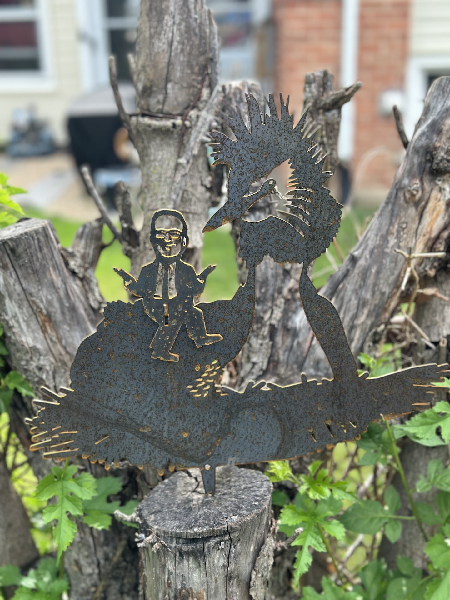

Since I'm currently spending more time outside enjoying the summer weather, I've also been able to admire my most obscure yard decoration.

If you don't watch [Last Week Tonight](https://www.hbo.com/last-week-tonight-with-john-oliver), you may not be familiar with [how John Oliver wielded his audience to help the pūteketeke win New Zeland's Bird of the Century competition](https://www.npr.org/2023/11/15/1213228757/john-oliver-new-zealand-bird-century-contest-puteketeke). You also wouldn't know that the [Metalbird](https://metalbird.com/) company went the extra mile and created a [tiny metal John Oliver](https://metalbird.com/products/puteketekes-friend) to compliment [their silhouette of the winning bird](https://metalbird.com/products/puteketeke).

What you might be less surprised by is the fact that this metal duo ended up under my Christmas tree this year.

It isn't the perfect placement - ideally the silhouette would be against the open sky, but I couldn't find a spot for that where it would still be visible. Still looks pretty cool where it lives, and hopefully it will catch the eye of our back yard guests. I also really love the look of the way the metal is weathering.
