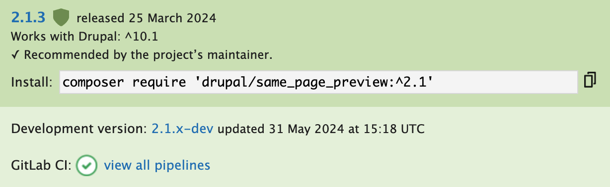

The Drupal Association now maintains a [GitLab CI Template](https://git.drupalcode.org/project/gitlab_templates/-/blob/main/gitlab-ci/template.gitlab-ci.yml) that can be used for all Drupal contrib projects. It's an excellent way to quickly take advantage of Drupal.org's CI system and ensure your project is following code standards and best practices. And using it has the bonus of giving you a sweet green checkmark on your project page!

We recently added this template to the [Same Page Preview](https://www.drupal.org/project/same_page_preview) module. After doing so, we noticed that our JavaScript linting was failing. This wasn't surprising since we hadn't yet committed a standard ESLint or Prettier configuration to the codebase. I took a shot at trying to resolve these linting issues, initially turning to the [ESLint Drupal Contrib plugin](https://www.npmjs.com/package/eslint-plugin-drupal-contrib). This allowed me to get ESLint up and running quickly and easily run linting with only within the context of this module. I resolved all of the linting issues, pushed my work up to GitLab, and started thinking about how I'd reward myself for a job well done.

### Disaster Strikes

And as you might expect, the CI build failed. 🤦‍♂️ (Autopilot suggested this emoji. AI might be good after all.)

At this point I took a step back. First off, I needed to determine what differed between my ESLint process, and the one that was being executed by the Drupal Gitlab CI Template. Secondly, beyond just getting the CI job to pass, I wanted to define more formally what linting use cases I wanted to solve for. I decided to focus on the following:

1. Determine how to run the exact same ESLint command that the GitLab CI Template was running, using the same configuration as Drupal Core.
2. Develope an ESLint configuration that could be run within the standalone module codebase (with or without an existing instance of Drupal) but matching Drupal Core and GitLab CI's configuration as closely as possible.

### Using the Drupal Core ESLint Configuration

- Using core (literally matching CI)
  - Command.
  - Still failing.
  - Copy prettier config.

### Using a Standalone ESLint Configuration

- Using eslint config.
  - Allows it to be run in isolation.

### Possible Follow Ups

- Follow ups:
  - Drupal’s prettier config should be a package. https://www.drupal.org/project/drupal_js/issues/3221703#comment-15604657
  - We should add this as a commit hook.

### Resources

- [Drupal GitLab CI Template](https://git.drupalcode.org/project/gitlab_templates/-/blob/main/gitlab-ci/template.gitlab-ci.yml)
