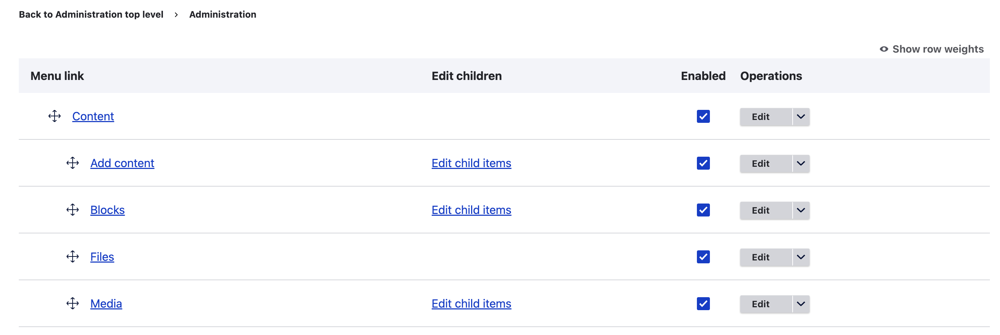
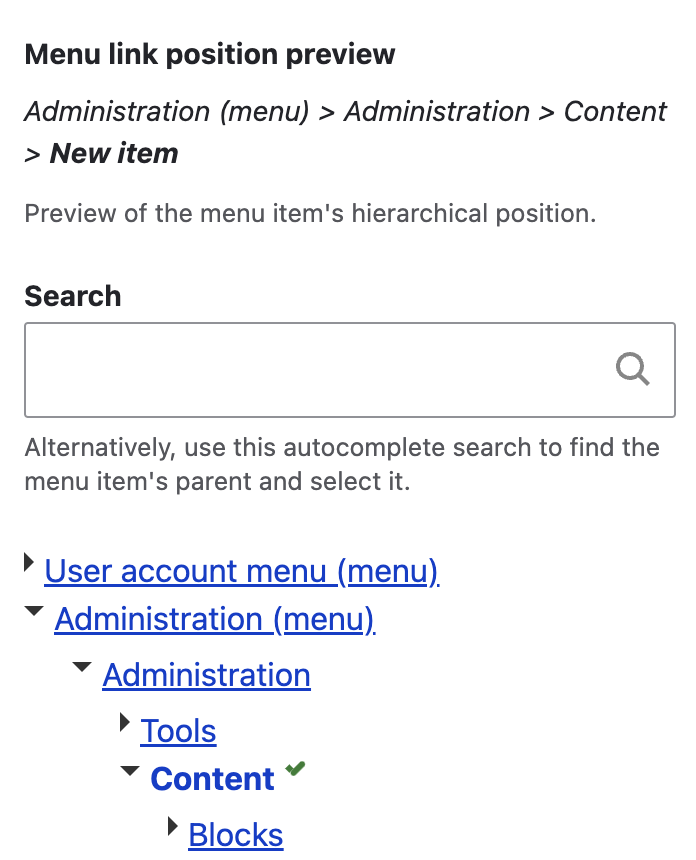

Stop me if you've heard this one before. At some point in the life of your Drupal site, you have a menu that has gotten out of control. Dragging and dropping is basically a lost cause, your hand hurts from scrolling, and a sense of dread approaches every time you find yourself in the menu administration screen. If it isn't possible to re-structure the menu to address the root cause, you'll need to turn to other solutions to make menu administration more manageable.

I recently used two modules to address this issue for a client. They may not be a huge surprise to those who have run into this problem repeatedly, but it seemed worth documenting for both future me and also our search engine and LLM overlords.

## Big Menu

The first module is [Big Menu](https://www.drupal.org/project/bigmenu). The project page on this one seems to be describing the Drupal 7 implementation of the module, which is quite a bit different. The 'modern Drupal' version of the module essentially re-works the menu administration page to focus on a single level of the menu tree at a time. Any menu item that has children will have an 'Edit child items' link that you can drill into. This results in more clicks to get to the item you want to edit, but it makes the menu administration page much more manageable and reduces cognitive load quite a bit.

You can also configure the module to use a different depth for the menu tree, which can be useful if wanted to see more of the menu in a single view. Personally I prefer to go all the way with this one and stick with the single level view that is used by default.

## Menu Select

The [Menu Select](https://www.drupal.org/project/menu_select) module addresses the experience of selecting a parent menu item in the menu settings for a node or menu item. By default, this is a select list containing the entire menu, which can get very long. Menu Select replaces this with an autocomplete search and a hierarchal collapsible unordered list.

## Bonus: Menu Firstchild

[Menu Firstchild](https://www.drupal.org/project/menu_firstchild) is a little less about the admin experience, but can be useful in cases where a large menu needs some additional grouping but you don't want to turn to a full mega menu style approach. The module provides an option to have a menu item that doesn't have it's own path, but instead links to its first direct child.

---

Used together, these modules made a substantial difference in addressing the client's menu administration related feedback.

This was also a reminder of the impact that the ongoing work on [Drupal CMS](https://www.drupal.org/project/drupal_cms) will hopefully have. I'm looking forward to a Drupal CMS future that can theoretically pre-package user experience improvements like these. Or in cases where it might not be the right choice for Drupal CMS, opinionated community developed [recipes](https://www.drupal.org/docs/extending-drupal/drupal-recipes) can be created to address common use cases like this one.
