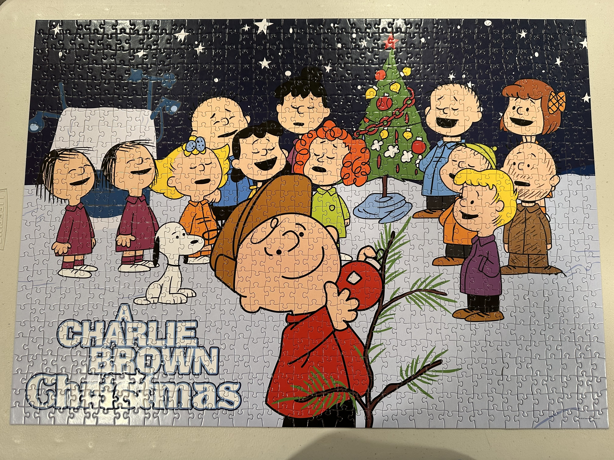
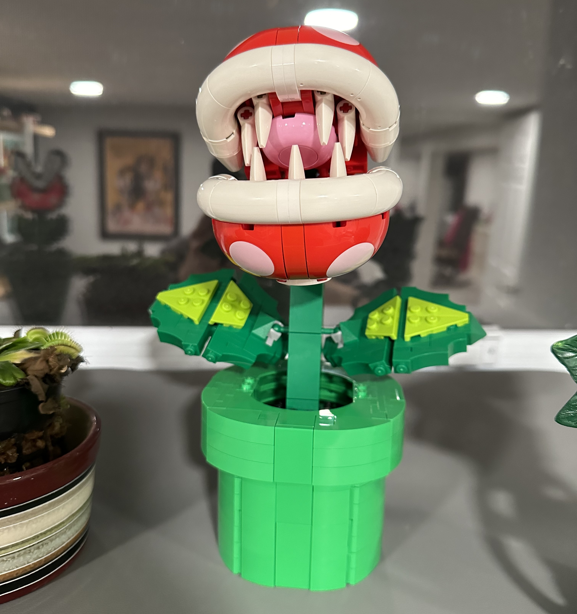
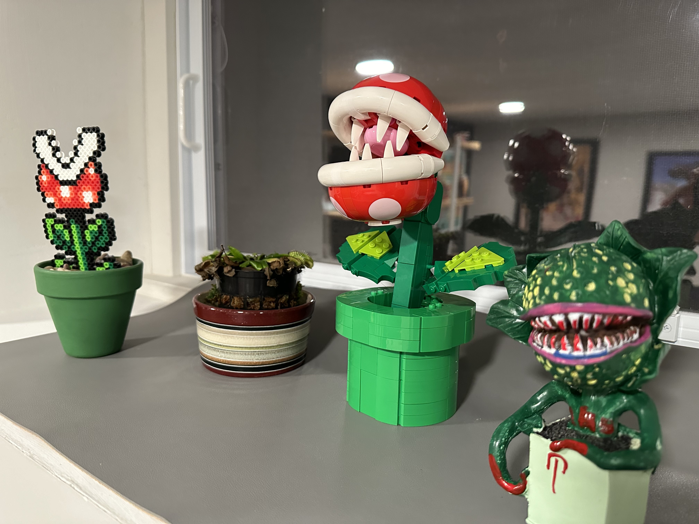
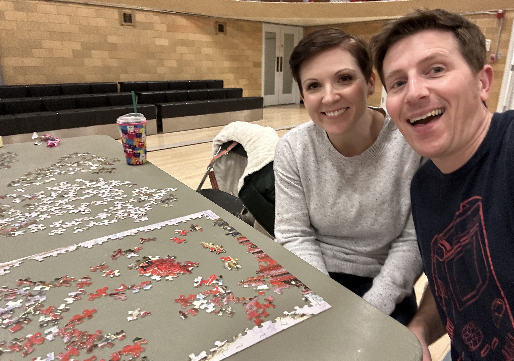

While we're far from the puzzle and Lego heyday that was the pandemic, things tend to slow down enough during winter break for me to party like it's 2020.

I put together this Charlie Brown Christmas puzzle like an advent calendar (hat tip to my Mom for this idea last year.) Each day I had access to 42 (technically 41.6 repeating) new pieces of this 1000 piece puzzle. Things kind of stacked up at the end, and I technically finished this up quite late on Christmas day.

Lego wise I put together the [Lego Piranha Plant](https://www.lego.com/en-us/product/piranha-plant-71426), which was a small but fun build.

The window well in my office features a growing variety of takes on the piranha plant, including an actual venus flytrap that is really struggling during the winter months. When I got the awesome 'real life' piranha plant (the nightmare 'Little Shop of Horrors' looking one) for Christmas I knew I had to get this Lego version to round out the collection.

Capping things off was our local park district's 'Puzzle Palooza', an [amusingly serious](https://www.facebook.com/watch/?v=708757353937811) two hour puzzle building competition. It was just my wife and I in what could have been a four person team, so we had no shot at winning. Even given that, we fared really poorly and didn't even complete the border of the puzzle. In our defense, this was a difficult puzzle with many irregular pieces. We got to keep the puzzle, so someday I'll have to see what those birds in snow really look like. Maybe it can be next year's advent puzzle.
