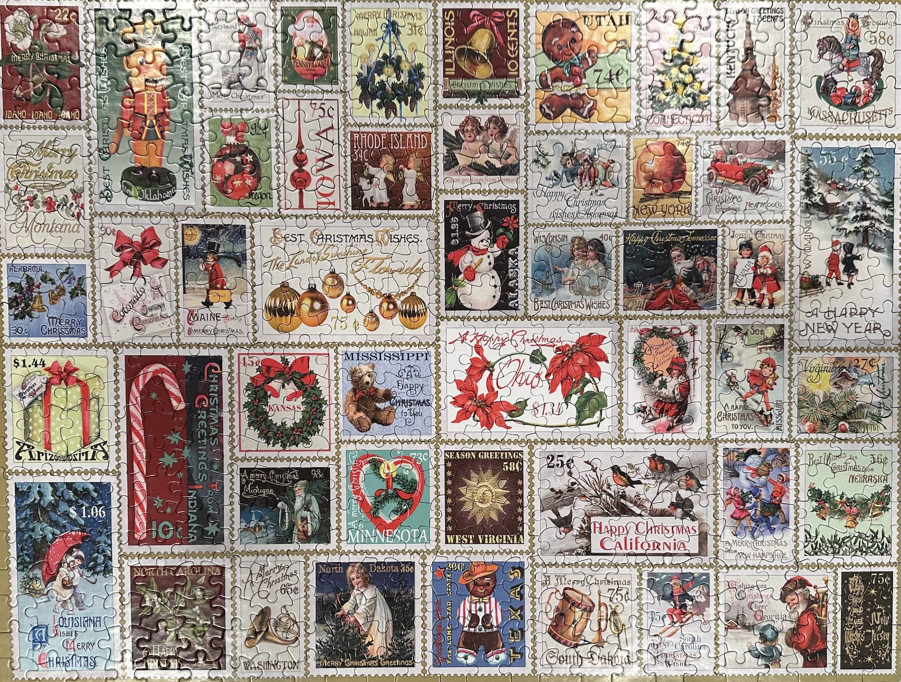

Had a wonderful two weeks off for the holidays this year, and I wanted to take a moment to reflect on some of the things that brought me joy over the break. Here are a few of the highlights:

## Holiday Celebration Nonsense 🎄

I have a habit of taking on elaborate and unnecessary holiday related projects every year. My theory is that I still get as excited for the Christmas as I did when I was a kid, and as an 'adult' this is how I channel that energy.

The largest of these projects is my now 6-year tradition of surprising my family with a light show in my basement on Christmas morning. The first couple of years, the light show itself was the surprise, but the past few years I've been finding ways to challenge expectations of what a 'light show' could even be. This year that resulted in me secretly renting a U-Haul and pre-loading it with lights. My family awoke to a basement with only one light set up, packages containing winter clothes, and instructions to go outside. Pretty proud of how it all turned out.

<iframe width="560" height="315" src="https://www.youtube.com/embed/A66dFP40ItU?si=f8GdG3rgiLLZRz7W" title="YouTube video player" frameborder="0" allow="accelerometer; autoplay; clipboard-write; encrypted-media; gyroscope; picture-in-picture; web-share" referrerpolicy="strict-origin-when-cross-origin" allowfullscreen></iframe>

I also made my first attempt at a [digital version of our family Christmas card](https://holiday.campperry.fun/). I also gave myself the additional challenge of trying to make it from scratch using exclusively AI tools. I'm hoping to write about the experience in more detail at some point, but I primarily used [bolt.new](https://bolt.new/), along with [ChatGPT](https://chatgpt.com/) for the video script, and [Synesthesia](https://www.synthesia.io/) for the video itself.

## Blue Man Group

It was announced that [Blue Man Group's multi-decade Chicago run was ending](https://blockclubchicago.org/2025/01/07/a-funeral-for-the-blue-man-group-chicago-says-farewell-to-iconic-performance-troupe/) in early January, so we got tickets for a show in the last week. I hadn't seen it since high school (a friend and I actually did the marshmallow catching thing for a school variety show,) and I especially wanted my son to see it due to his interest in percussion. I could feel the age in the show a little bit, but it was still a lot of fun, and I'm glad we got to see it before the run ended. And Colin seemed to really enjoy it.

## Games

There are always video games on holiday break, and I usually try to start something new on Christmas Day.

- [1000xRESIST](https://www.nintendo.com/us/store/products/1000xresist-switch/) - heard nothing but good things and have been really blown away by this game so far. If you are open to visual novels and sci-fi games I can't recommend it enough.
- [Zelda: Echoes of Wisdom](https://www.nintendo.com/us/store/products/the-legend-of-zelda-echoes-of-wisdom-switch/?srsltid=AfmBOoofjjHw1sJ2Cm_x17xfGsnjt) - this game has some fundamental problems, but it still ended up being my gaming comfort food over the break.
- [Indiana Jones and the Great Circle](https://indianajones.bethesda.net/en-US) - only fired this up a few times, but it yielded an all time gaming highlight:

<iframe width="560" height="315" src="https://www.youtube.com/embed/BBkp7hFnUio?si=NJLSo_dofTA5_Fsd" title="YouTube video player" frameborder="0" allow="accelerometer; autoplay; clipboard-write; encrypted-media; gyroscope; picture-in-picture; web-share" referrerpolicy="strict-origin-when-cross-origin" allowfullscreen></iframe>

## TV

Is it still TV if I mostly watched it on an iPad?

- [Mr. And Mrs. Smith](https://www.imdb.com/title/tt14044212/) - finally got around to this and really dug it. Went down real easy and I liked how it wrapped up.
- [Squid Game Season 2](https://www.imdb.com/title/tt10919420/episodes/?season=2) - Not sure this really needed to exist, but an easy holiday binge like the first season.

## Guitar

My son got an electric guitar for Christmas, and I threatened that if that happened I'd almost certainly end up getting a guitar for myself. So I did! I splurged on [this tech enabled electric acoustic](https://www.lavamusic.com/lava-me-4-spruce). For a variety of reasons it probably wasn't the right choice for a complete beginner, but the bells and whistles are fun so I've decided to stick with it. Didn't really get started until the end of break. Related: my hand hurts.

## Puzzles

I put this one together.

Hang in there for the non-holiday season. We can make it to the next one, I swear.
