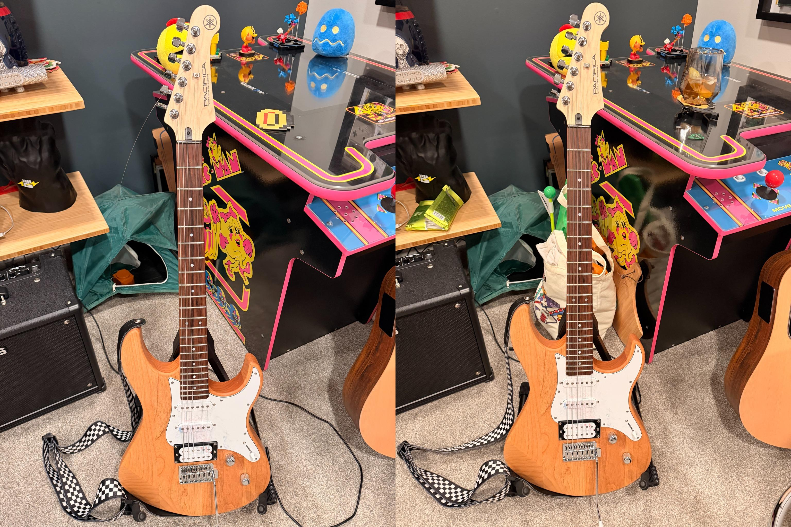

I got an electric guitar in late December. And in February I broke a string (strum too hard much?) I knew at some point I would eventually break a string. My assumption was that I would have to take it somewhere to be restrung, or maybe I would just throw my guitar away and quit playing altogether.

Instead, I tried doing it myself. I knew it would probably be bad. I bought multiple sets of guitar strings assuming that I would do it wrong the first time. I kind of did do it wrong. In the picture below, can you determine which string was the one I restrung? I bet you can.

Ugly, but it works. And it sounds fine, at least to my not very well trained ears. But something about this experience stuck with me. I'll probably restring this guitar multiple times. But I'm just left with the lingering thought that there's something special about doing something poorly for the very first time.

