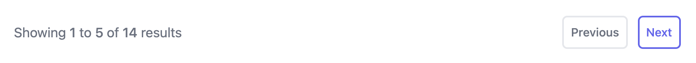

11ty can handle pagination really well, but finding the right subset of the many pagination features can be a little difficult to figure out. In my case, I just wanted something really simple so that I didn't end up with endlessly scrolling list pages as this site grows. Since this site uses [Tailwind](https://tailwindcss.com/), I decided to aim for something similar to the [simple card footer from Tailwind UI](https://tailwindui.com/components/application-ui/navigation/pagination#component-0797a02a34692167c369d134e7a6f9c5).

At its simplest, page data can be enabled by adding the `pagination` key to your template's front matter. The first example from the [pagination docs](https://www.11ty.dev/docs/pagination/) shows how to page over a dataset also defined in your front matter:

```yml
---
pagination:
  data: testdata
  size: 2
testdata:
  - item1
  - item2
  - item3
  - item4
---
<ol>

<li>{{ item }}</li>

</ol>
```

In my case, I was looking to [add pagination to a collection](https://www.11ty.dev/docs/pagination/#paging-a-collection). [My existing template](https://github.com/backlineint/bpi-11ty/blob/8ebdd42966106e98ea172781d08a0027586d44bf/src/all/index.html) set a variable for the collection, and then used a filter to reverse it.

```twig



{# iterate through posts #}

```

We can instead use the pagination key in our front matter to prepare this data:

```yml

title: "All Updates"
pagination:
data: collections.all
size: 5
alias: postslist
reverse: true

---


{# iterate through posts #}

```

We specified the collection that should be used as the dataset, the number of posts that should display on each page, and reversed the results. And by using the alias of `postslist` I didn't have to change variable names in any of my existing markup. You could instead use the default `pagination.items` if you were starting from scratch.

Now on to the pager itself. First let's look at displaying the current page and result set.

```twig


  <div class="pb-6 sm:pb-0">
    <p class="text-md text-gray-500">
      Showing
      <span class="font-medium">
        {{ (pagination.pageNumber * pagination.size) + 1 }}
      </span>
      to
      <span class="font-medium">
        
          {{ (pagination.pageNumber * pagination.size) + pagination.size }}
        
          {{ collections.all.length }}
        
      </span>
      of
      <span class="font-medium">{{ collections.all.length }}</span>
      results
    </p>
  </div>

```

As you can see in that code snippet, 11ty's gives us a bunch of helpful data in the pagination object. We can use `pagination.pageLinks.length` to determine if there is even enough data to page - if there is only one page, we don't render the pagination at all. We're also doing a tiny little bit of math to determine the current range of posts that are displayed (I should have warned you that there would be math.) In `(pagination.pageNumber * pagination.size) + 1` we're adding 1 because page number is zero indexed. And we can use `collections.all.length` for the overall number of posts.

Next, let's add the previous and next links. I based this on [an example from an 11ty github issue](https://github.com/11ty/eleventy/issues/455#issuecomment-474026138):

```twig
<nav class="pagination">
  
    <a class="pagination__item" href="{{ pagination.previousPageHref }}">Previous</a>
  
    <span class="pagination__item">Previous</span>
  
  
    <a class="pagination__item" href="{{ pagination.nextPageHref}}">Next</a>
  
    <span class="pagination__item">Next</span>
  
</nav>
```

If there is a `previousPageLink` or `nextPageLink` we're displaying as a link, otherwise we're displaying as a span to indicate that the option is disabled. And the link to the previous or next page of results is available in `pagination.previousPageHref` and `pagination.nextPageHref` respectively.

After layering in some Tailwind classes the end result looked like this:



Putting it all together, here's the final pagination partial. I'm using a variable `length` rather than `collections.all.length` so this pagination partial can be used with other collections.

<script src="https://emgithub.com/embed-v2.js?target=https%3A%2F%2Fgithub.com%2Fbacklineint%2Fbpi-11ty%2Fblob%2Fmaster%2Fsrc%2F_includes%2Fpartials%2Fpagination.html&style=default&type=code&showBorder=on&showLineNumbers=on&showFileMeta=on&showFullPath=on&showCopy=on"></script>

Resources:

- [11ty Pagination](https://www.11ty.dev/docs/pagination)
- [11ty Pagination Navigation](https://www.11ty.dev/docs/pagination/nav/)
- [Github issue - Pagination is very confusing](https://github.com/11ty/eleventy/issues/455)
- [Tailwind UI Simple Card Footer](https://tailwindui.com/components/application-ui/navigation/pagination#component-0797a02a34692167c369d134e7a6f9c5)
