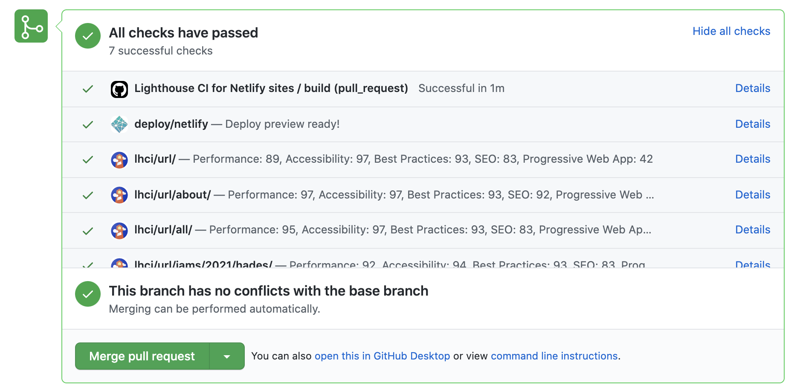

I'll be spending a lot of time auditing web performance over the next couple of weeks, and along the way expect to be setting up some tooling that I haven't used before. First on the list was Lighthouse CI, which I took for a spin in a Github repository. I initially set this up manually following [the getting started docs](https://github.com/GoogleChrome/lighthouse-ci/blob/main/docs/getting-started.md), but eventually learned that the [Lighthouse CI Action](https://github.com/marketplace/actions/lighthouse-ci-action) met my needs nicely.

First, I added a `budget.json` file which I will eventually assert against:

```json
[
  {
    "path": "/*",
    "resourceSizes": [
      {
        "resourceType": "document",
        "budget": 18
      },
      {
        "resourceType": "total",
        "budget": 200
      }
    ]
  }
]
```

This is just the default example from the docs, I'll be defining what the actual budget should be as I get deeper into auditing.

Next I created `.github/workflows/ci.yml` with the following contents:

```yml
name: Lighthouse CI for Netlify sites
on: pull_request
jobs:
  build:
    runs-on: ubuntu-latest

    steps:
      - uses: actions/checkout@v2
      - name: Use Node.js 14.x
        uses: actions/setup-node@v1
        with:
          node-version: 14.x
      - name: Install & Build
        run: |
          npm install
          npm build
      - name: Wait for the Netlify Preview
        uses: jakepartusch/wait-for-netlify-action@v1
        id: netlify
        with:
          site_name: 'my-fun-netlify-name'
      - name: Audit URLs using Lighthouse
        uses: treosh/lighthouse-ci-action@v7
        with:
          urls: |
            ${{ steps.netlify.outputs.url }}
            ${{ steps.netlify.outputs.url }}/about/
            ${{ steps.netlify.outputs.url }}/all/
            ${{ steps.netlify.outputs.url }}/jams/2021/hades/
            ${{ steps.netlify.outputs.url }}/posts/2021/gatsby-source-drupal-only-referenced-images/
          budgetPath: ./budget.json
          temporaryPublicStorage: true
```

This isn't the default recipe, but it allowed me to wait for Netlify's deploy preview to complete and then run lighthouse on the actual preview site. In my case I also needed to bump things up to a more recent version of node instead of the default. I also removed `uploadArtifacts: true` as I don't know that I really need the reports to persist long term (I can always re-enable this later).

At this point, I had the lighthouse reports running, but I had to dig into the build logs to get them. Thankfully it was possible to configure [Github status checks](https://github.com/GoogleChrome/lighthouse-ci/blob/main/docs/getting-started.md#github-status-checks) to see the results right in the Github pull request UI. I had to authorize [the Lighthouse CI Github App](https://github.com/apps/lighthouse-ci) which provided me an authorization token. Under the settings for my repository I then added that token as a repository secret called `LHCI_GITHUB_APP_TOKEN`. To add the checks to my CI job I had to add two sections to my `.github/workflows/ci.yml`.

First, I had to add a reference to the related git history:

```yml
steps:
  - uses: actions/checkout@v2
    with:
      ref: ${{ github.event.pull_request.head.sha }}


I missed this part initially. Without it the status checks will be sent, but they won't be able to be tied to the correct PR.

Lastly, I had to add a the repository secret as an environment variable:


- name: Audit URLs using Lighthouse
  uses: treosh/lighthouse-ci-action@v7
  with:
    urls: |
      ${{ steps.netlify.outputs.url }}
      ${{ steps.netlify.outputs.url }}/about/
      ${{ steps.netlify.outputs.url }}/all/
      ${{ steps.netlify.outputs.url }}/jams/2021/hades/
      ${{ steps.netlify.outputs.url }}/posts/2021/gatsby-source-drupal-only-referenced-images/
    budgetPath: ./budget.json
    temporaryPublicStorage: true
  env:
    LHCI_GITHUB_APP_TOKEN: ${{ secrets.LHCI_GITHUB_APP_TOKEN }}
```

With all of that in place I now see entries for each lighthouse check, and can click on the details link to launch the report.



This site isn't actually what I'm auditing, but it still looks like I've got some work to do :)