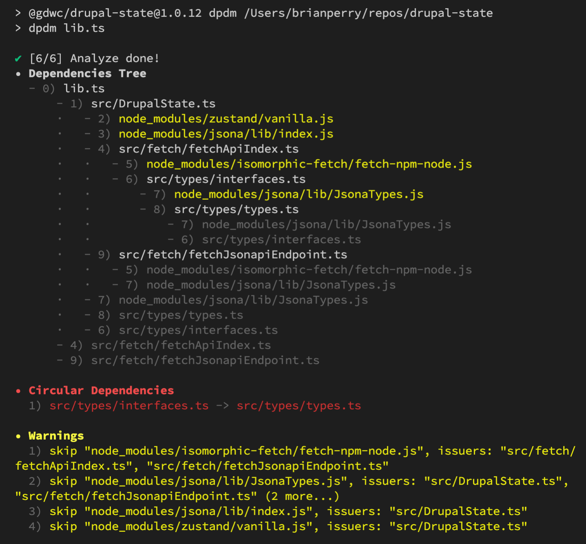
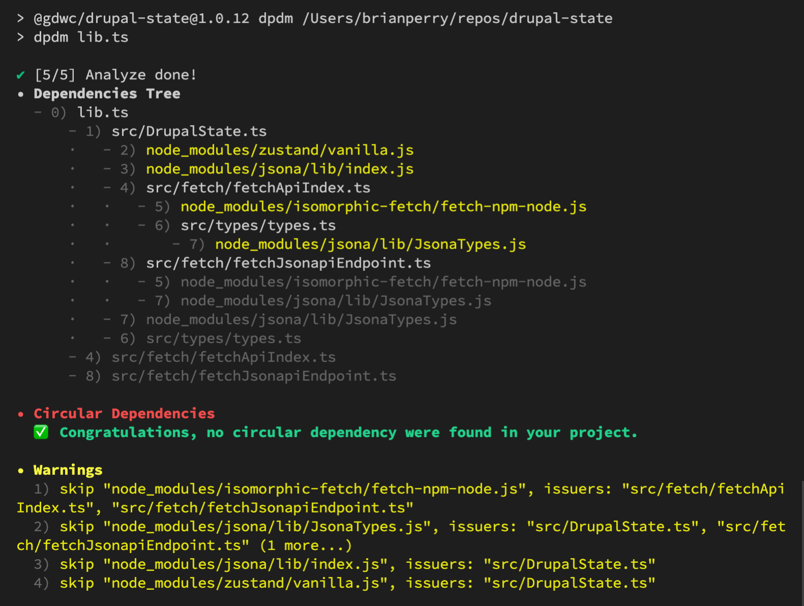

While recently scouring Stack Overflow to debug a vague error in a JavaScript library I was working on, one of the possible causes I kept running into was a circular dependency introduced in module imports. Seemed plausible that I could have made that mistake, but given that I may have been foolish enough to introduce a circular dependency in the first place, tracking it down myself seemed like a tall order.

Thankfully there are a handful of NPM packages that can do all the work for you. I first tried [Madge](https://www.npmjs.com/package/madge) which seemed to be the most popular solution. It did have an option to identify circular dependencies, but that information wasn't included in the default output. It also has an impressive dependency visualization option, but it required manually installing a homebrew package.

I next tried [dpdm](https://www.npmjs.com/package/dpdm) which was simpler to use, and covered more of my needs by default. Here's what the output looked like when run against the main entry point of my library:

There was in fact a circular dependency between my TypeScript types and interfaces. Real rookie mistake right there. Combining the interfaces and types into a single file eliminated the circular dependency and got dpdm to stop yelling at me.

Ironically after all that, the circular dependency wasn't even the cause of the error I was seeing. I'm glad I found this handy little utility though, and hopefully working through this will make me less likely to introduce a circular dependency in the future.