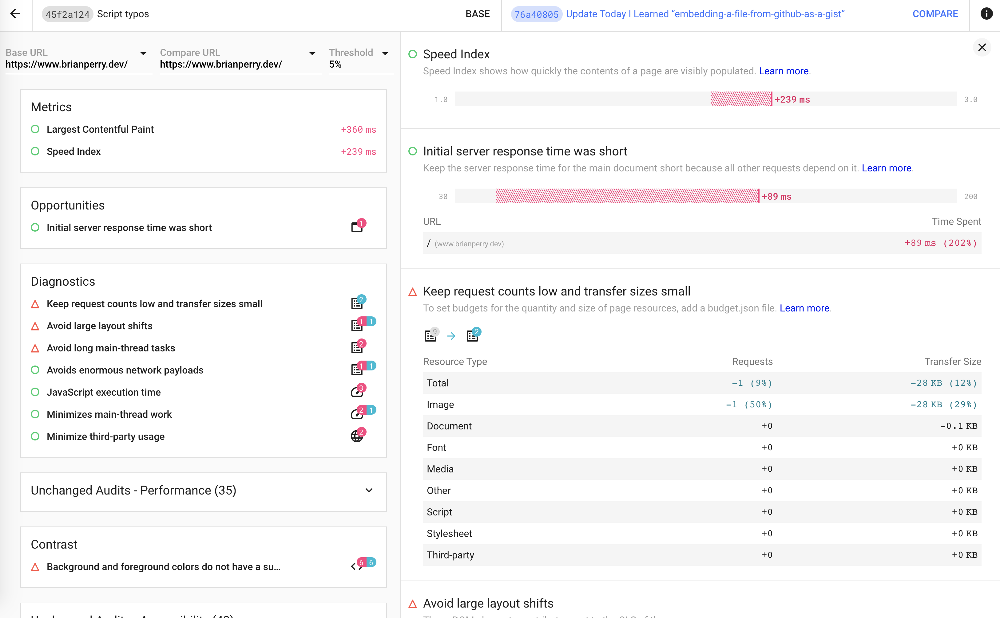

I had previously [set up Lighthouse CI with Github Actions](/til/2021/configuring-lighthouse-ci-with-github-actions/), but I still found myself looking longingly at the [reports provided by Lighthouse CI Server](https://twitter.com/_developit/status/1266112451155841024) as a way to compare results over time. While the docs are mainly focused on running on a public server with persistent storage (which is clearly the most useful way to do this,) I couldn't help but wonder if I could run the server locally to capture some quick data comparing a few specific changes. Turns out you absolutely can. The docs provide [an example Docker container to use locally](https://twitter.com/_developit/status/1266112451155841024), but I went with the even lower-fi solution.

From within the repository containing the code that I'm measuring, I added packages for Lighthouse CI Server, along with sqlite for data storage.

    npm install -D @lhci/cli @lhci/server sqlite3

I also added [Concurrently](https://www.npmjs.com/package/concurrently) as it made it easier to start the server and collect data in one fell swoop:

    npm install -D concurrently

While I was messing around with `package.json` I added the following scripts:

```json
"scripts": {
  "lhci:audit": "concurrently \"npm run lhci:server\" \"lhci autorun\"",
  "lhci:wizard": "lhci wizard",
  "lhci:server": "lhci server --storage.storageMethod=sql --storage.sqlDialect=sqlite --storage.sqlDatabasePath=./db.sql"
},
```

With those scripts in place, I can start the server by running:

    npm run lhci:server

And then run the wizard with:

    npm run lhci:wizard

The wizard will ask you a few questions about your server and your code repository, and then provide your build token and admin token. With that information in hand, I added `lighthouserc.js` in the root of my repository containing the following:

```javascript
module.exports = {
  ci: {
    collect: {
      url: ['https://www.brianperry.dev'],
    },
    upload: {
      target: 'lhci',
      serverBaseUrl: 'http://localhost:9001',
      token: '###-###-###', // the build token provider by the wizard. Could also use LHCI_TOKEN variable instead
    },
  },
};
```

In my case, I added `lighthouserc.js` to the `.gitignore` for my project because I didn't want these local settings to override the Lighthouse settings I already had working with Github Actions. You may also want to ignore `.lighthouseci/` and `db.sql` as well if you are only planning to store this information locally.

With that in place I can now run

    npm run lhci:audit

which will start the Lighthouse CI Server and record results for the current commit. If I run this repeatedly as commits are made, I can get a granular comparison of the impact of my changes.



This would certainly be more useful incorporated into your main CI process, but this local approach can still be useful for benchmarking a feature branch or making some other small scale measurement.
