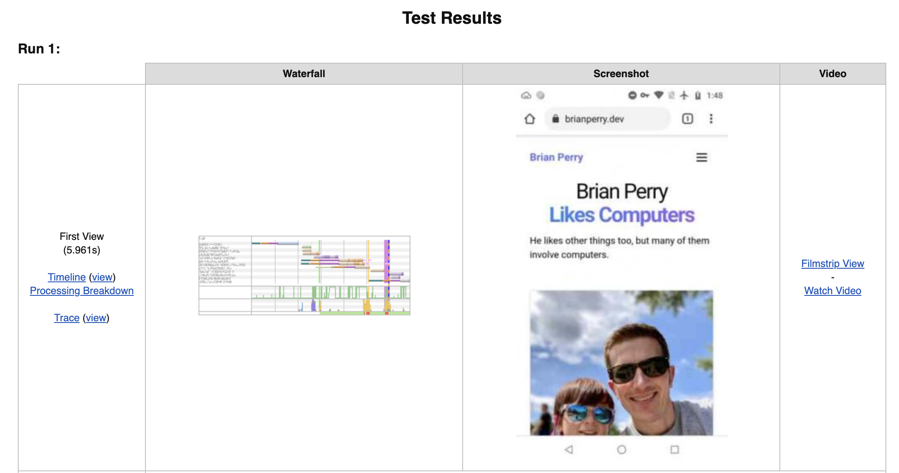

Sometimes when auditing Lighthouse results the amount of feedback can make it difficult to determine what to focus on improving. In cases like those, a screen recording can provide quite a bit of clarity.

[Web Page Test](https://www.webpagetest.org/) provides a number of easy options to generate a recording of your test runs. When setting up a test, check 'capture video' in the advanced options. You can then save the recording as a video or a gif after clicking on the 'watch video' link in the related column. Or you can enter the timeline view, configure options like frame size and slow motion, and export your recording.

Here is an example [recording of the homepage of this site being loaded](/static/img/bpdev.gif). You'll see a pretty obvious problem - the menu is loading as expanded and then collapsing when JavaScript executes, which is likely causing [cumulative layout shift](https://web.dev/cls/). I've found that a slow motion video can also make less glaring issues clear, like web fonts shifting during load.

For a paid alternative, [Calibre](https://calibreapp.com/) automatically captures and archives a video recording of each test run. And if you're specifically trying to eliminate layout shift, this [layout shift gif generator](https://defaced.dev/tools/layout-shift-gif-generator/) can be helpful.

You can get similar insights by scrolling through the timeline view in the performance tab in Chrome, but there is just something about a video that clicks for me a little easier. Grab some 🍿, sit back, and find those page loading bottlenecks.
